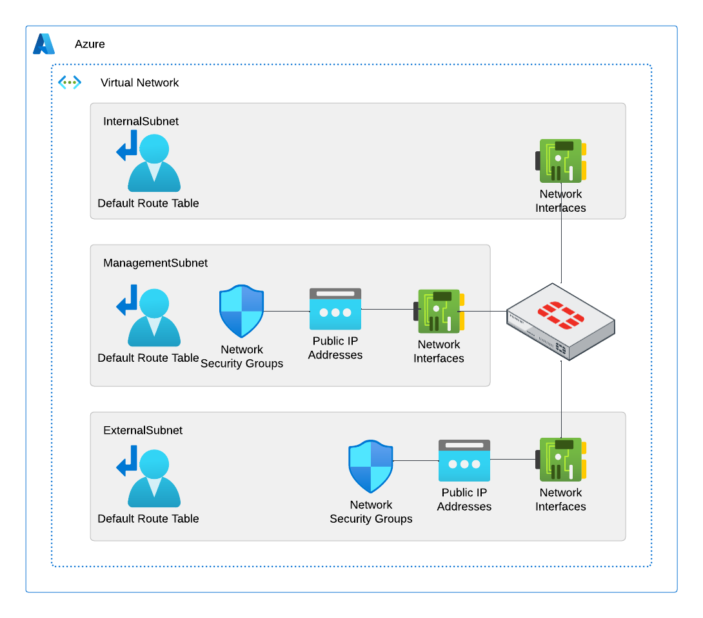

# Fortinet ARM Templates

:cloud: - [Introduction](#introduction) - [Design](#design) - [Deployment](#deployment) - [Requirements](#requirements-and-limitations) - [Configuration](#configuration) - :cloud:

## Introduction

This template is for a Single Fortigate with Route Tables

## Design

This deployment will deploy a single Fortigate to a VNET. Four total subnets are required External, Internal, Manaagement, and RouteServerSubnet. Three nics are deployed for the fortigate in the first three subnets.  The external and managment subnets will have Standard Static Public IPs attached to the network interface. NSGs will be applied to these interfaces to allow for access to the public IPs. Route Tables are deployed to the Internal Subnet to route all traffic to the internal interface of the FortiGate.

The Azure ARM Template will deploy the following resources:

- 1 Virtual Network with 3 Subnets
- 1 Fortigate Firewall with 3 NICs
- 2 Public IP Addresses
- 1 Network Security Group
- 1 Route Tables

This template can be utlized for deployement in an existing VNET, Availability Set, Availability Zones, or Route Server.

## Deployment

This template can be deployed from the Azure CLI, Azure Powershell, or through the Azure Portal by clicking the button below.  The following Parameters must be provided.

Required Parameters:

- CUSTOMER NAME: Name of the customer to use a standard naming convention.
- FORTIGATE ADMIN USERNAME: Admin username for the Fortigate.
- FORTIGATE ADMIN PASSWORD: Admin password for the Fortigate.

For new VNET deployments the name of the VNET and Subnets can be left at their defaults.  The template will autoatically apply a name to the new VNET and Subnets. Enter a name if you wish to overwrite the default behavior.

New VNET Parameters:

- VNET ADDRESS PREFIX: Address prefix of the new VNET.
- SUBNET 1 EXTERNAL PREFIX: Address prefix of the external subnet.
- SUBNET 1 EXTERNAL START ADDRESS: First usable address in the external subnet.  The first three are reserved for Azure.
- SUBNET 2 INTERNAL PREFIX: Address prefix of the internal subnet.
- SUBNET 2 INTERNAL START ADDRESS: First usable address in the internal subnet.  The first three are reserved for Azure.
- SUBNET 3 MANAGEMENT PREFIX: Address prefix of the managment subnet.
- SUBNET 3 MANAGEMENT START ADDRESS: First usable address in the managment subnet.  The first three are reserved for Azure.

Existing VNET Parameters:

- VNET NAME: Name of the existing VNET.
- VNET ADDRESS PREFIX: Address prefix of the VNET.
- SUBNET 1 EXTERNAL NAME: Subnet name where external interface will be deployed.
- SUBNET 1 EXTERNAL PREFIX: Prefix of external subnet.
- SUBNET 1 EXTERNAL START ADDRESS: Next usable address in the subnet.
- SUBNET 2 INTERNAL NAME: Subnet name where internal interface will be deployed.
- SUBNET 2 INTERNAL PREFIX: Prefix of internal subnet.
- SUBNET 2 EXTERNAL START ADDRESS: Next usable address in the subnet.
- SUBNET 3 MANAGEMENT NAME: Subnet name where managment interface will be deployed.
- SUBNET 3 MANAGEMENT PREFIX: Prefix of management subnet.

### Azure Portal

Standard Custom Template Deployment:

## Requirements-and-limitations

## Configuration
